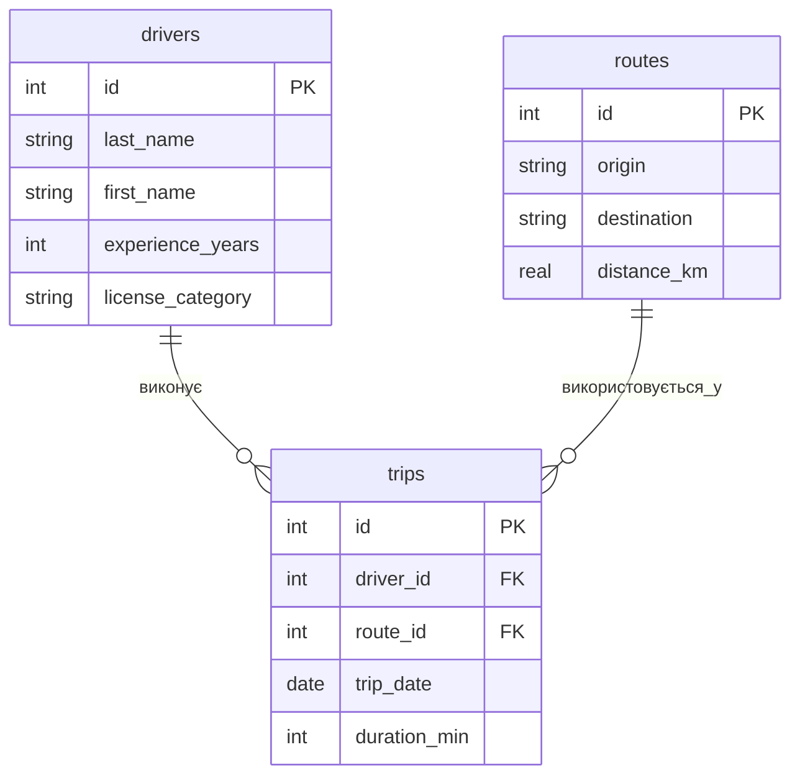
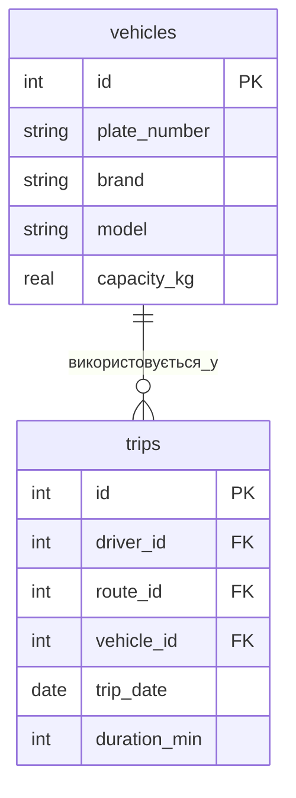

# Практична робота №3 Варіант 10

# Завдання 1. ER-діаграма

`drivers` і `routes` — вимірні таблиці, `trips` — фактова таблиця. `trips.driver_id` посилається на `drivers.id`, а `trips.route_id` — на `routes.id`.

# Завдання 2. Тип зв'язків

`drivers — trips`: **1:N**. Один водій може виконати багато поїздок, але кожна поїздка має одного водія.

`routes — trips`: **1:N**. Один маршрут може використовуватися в багатьох поїздках, але кожна поїздка має один маршрут.

# Завдання 3. Ключі

`drivers`: `id` — PRIMARY KEY; зовнішніх ключів немає.

`routes`: `id` — PRIMARY KEY; зовнішніх ключів немає.

`trips`: `id` — PRIMARY KEY; `driver_id` — FOREIGN KEY → `drivers.id`; `route_id` — FOREIGN KEY → `routes.id`.

# Завдання 4. Нова сутність

До схеми можна додати `vehicles` — транспортні засоби:

Новий зв'язок — **1:N**: один транспортний засіб може використовуватися в багатьох поїздках, а кожна поїздка має один транспортний засіб. Новий зовнішній ключ: `trips.vehicle_id → vehicles.id`.

# Завдання 5. Порівняння

Як і в прикладі, моя схема має дві вимірні таблиці та одну фактову таблицю. Фактова таблиця містить зовнішні ключі до обох вимірних таблиць, а обидва зв'язки мають тип 1:N. Відмінність — предметна область: у прикладі `products`, `customers`, `orders`, а у варіанті 10 `drivers`, `routes`, `trips`.

# Контрольні питання

1. Концептуальна модель описує сутності та зв'язки на загальному рівні. Логічна перетворює їх на таблиці, стовпці та ключі. Фізична показує конкретну реалізацію в певній СУБД, включно з типами даних, індексами та обмеженнями.

2. Зв'язок M:N не можна нормально реалізувати лише двома зовнішніми ключами, бо один запис може бути пов'язаний з багатьма записами іншої таблиці. Тому потрібна проміжна таблиця, яка зберігає пари зовнішніх ключів і кожен окремий зв'язок.

3. У Mermaid `||` означає «рівно один», а `o{` — «нуль або багато». Тому `A ||--o{ B` означає: один запис A може бути пов'язаний з нулем або багатьма записами B.